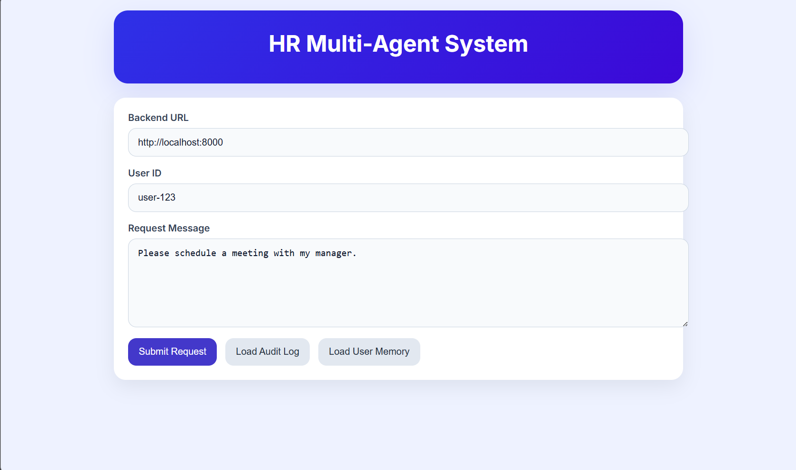
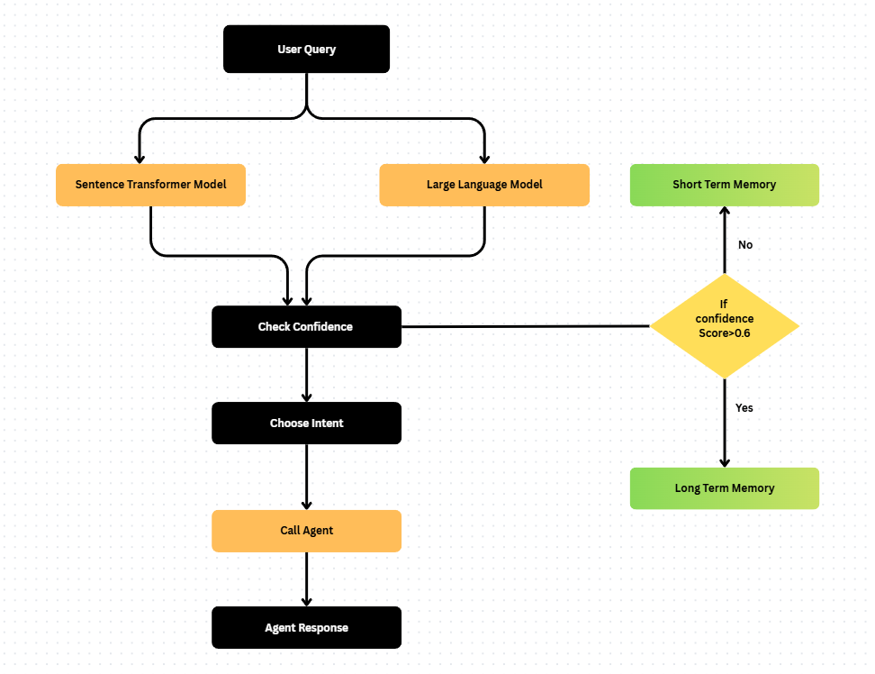

# HR Multi-Agent Automation Platform
---

### System Demostration

[](https://youtu.be/0sCqnCXkEkM)

---


## System Architecture




## Project Structure

```text
hr_system/
├── app/
│   ├── agents/             # Specialist agents, Orchestrator, and Classifier logic
│   ├── api/                # REST API route definitions and health checks
│   ├── audit/              # Append-only auditing system models and loggers
│   ├── memory/             # Two-tier (STM/LTM) memory management and scoring
│   ├── services/           # LLM clients, LangGraph workflow, and utility services
│   ├── config.py           # Pydantic-based configuration management
│   ├── database.py         # SQLAlchemy engine and session setup
│   ├── main.py             # FastAPI application factory and error handlers
│   └── schemas.py          # Pydantic models for requests and responses
├── flask_app.py            # Flask frontend implementation
├── streamlit_app.py        # Streamlit dashboard implementation
├── run.py                  # Main entry point for the FastAPI server
├── requirements.txt        # Project dependencies
└── .env                    # Environment variables (API keys, DB paths)
```

---

## Overview
This project builds an HR automation backend using an agent-based workflow that processes user requests step by step. First, when a user submits a query, the system loads relevant context by retrieving both recent activity (short-term memory) and stored historical data (long-term memory). Next, it identifies what the user wants through an intent detection stage that combines large language models and semantic matching for accurate classification. Based on this intent, the system routes the request to a specialized agent, such as scheduling, leave management, or compliance, which handles the task and generates a response. Finally, the system completes the process by saving updates to the user’s memory and recording the entire interaction in a secure audit log, ensuring traceability before returning the final answer to the user.

## Architecture

- `app/main.py` - FastAPI application setup with global error handling.
- `app/api/routes.py` - REST endpoints for request handling, audit retrieval, memory management, and health checks.
- `app/agents/orchestrator.py` - Central orchestrator that routes user requests through the Langgraph workflow.
- `app/services/langgraph_flow.py` - Langgraph graph with intent classification and agent routing.
- `app/agents/classifier.py` - LLM-backed classification with embeddings, semantic similarity, and confidence calibration.
- `app/agents/router.py` - Maps inferred intents to specialist agents.
- `app/memory/` - Two-tier memory with STM and LTM and significance scoring.
- `app/audit/` - Append-only audit logger and storage.
- `app/services/openai_client.py` - OpenAI SDK client for chat completions and embeddings using configured base URL.
- `app/services/embedding_service.py` - Semantic similarity utilities.
- `flask_app.py` - Simple Flask UI for submitting requests, viewing audit logs, and checking user memory.
- `streamlit_app.py` - Optional Streamlit UI for browser interaction with the FastAPI backend.

## API Endpoints

- `POST /request` - Process a user request and return intent, confidence, response, and routed agent.
- `GET /audit` - Retrieve audit log entries.
- `GET /memory/{user_id}` - Retrieve stored long-term memory for a user.
- `DELETE /memory/{user_id}` - Clear long-term memory for a user.
- `GET /health` - Health check endpoint.

## Deployment

1. update `.env` with `OPENAI_API_KEY`, `OPENAI_BASE_URL`, `MODEL_NAME`, and `SQLITE_DB`.
2. Install dependencies:
   ```bash
   pip install -r requirements.txt
   ```
3. Start the FastAPI service:
   ```bash
   python run.py
   ```
4. Start the Flask UI in a separate terminal:
   ```bash
   python flask_app.py
   ```


## Notes

- The intent classifier  uses an LLM plus embeddings for robust intent routing.
- Low-confidence or out-of-scope requests are routed to the `ClarificationAgent`.
- Raw Python stack traces are hidden from API clients via a global exception handler.
- Audit logs are append-only, and memory reads are exposed through safe endpoints.
